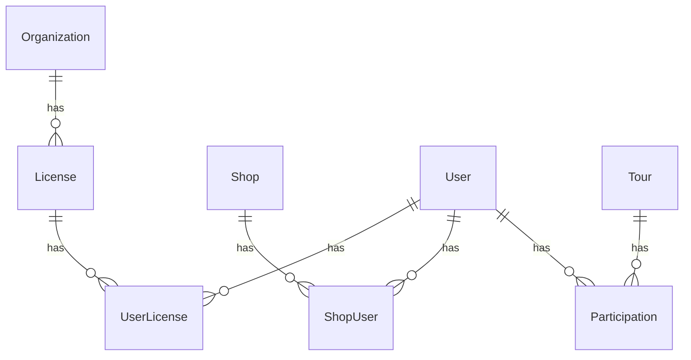

# データベース設計

## テーブル定義

### Shop

| column | type | null | name | memo |
|---|---|---|---|---|
| uuid | string | x | uuid ||
| name | string | x | 店舗名 ||

### ShopUser

| column | type | null | name | memo |
|---|---|---|---|---|
| shopId | integer | x | ショップID ||
| userId | integer | x | ユーザID ||

### User

| column | type | null | name | memo |
|---|---|---|---|---|
| uuid | string | x | uuid ||
| name | string | x | 名前 ||
| email | string | x | メールアドレス ||
| role | integer | x | 権限 | 10: システム管理者 20: 店舗ユーザ 30: 顧客ユーザ |
| hiddenAt | timestamp | o | 無効化日時 ||
| createdAt | timestamp | x | 作成日時 ||

### Organization

| column | type | null | name | memo |
|---|---|---|---|---|
| uuid | string | x | uuid ||
| name | string | x | 団体名 ||

### License

| column | type | null | name | memo |
|---|---|---|---|---|
| uuid | string | x | uuid ||
| name | string | x | ライセンス名 ||
| organizationId | integer | x | 団体ID ||

### UserLicense

| column | type | null | name | memo |
|---|---|---|---|---|
| userId | integer | x | ユーザID ||
| licenseId | integer | x | ライセンスID ||

### Tour

| column | type | null | name | memo |
|---|---|---|---|---|
| uuid | string | x | uuid ||
| title | string | x | ツアータイトル ||
| eventFromDate | date | x | ツアー開始日 ||
| eventToDate | date | x | ツアー終了日 ||
| status | integer | x | ステータス | 0: 非公開 1: 公開 |
| participantsNumber | integer | x | 参加可能人数 ||

### Participation

| column | type | null | name | memo |
|---|---|---|---|---|
| userId | integer | ユーザID |||
| tourId | integer | ツアーID |||

## ER図

